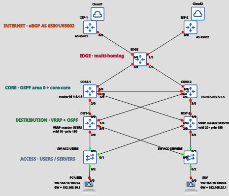

| <h1>UTN-FRLP</h1> |  |
|-------------------------|----------------------------------|

# Proyecto Integrador — Failover Routing: la red que no se cae

Laboratorio grupal de **Gestión Operativa y Seguridad en Redes (GOYS)**, UTN FR La Plata. Diseño, implementación, operación y aseguramiento de una red empresarial de 5 capas (Internet, Edge, Core, Distribución y Acceso) con redundancia de primer salto (**VRRP**), de IGP (**OSPF**) y de proveedor (**BGP multi-homing**), sobre **GNS3 + MikroTik CHR (RouterOS 7)**.

**Grupo 2** · Entrega final: viernes 23/10/2026

---

## Integrantes

| Integrante | Rol |
|-----------|-----|
| Eliseche, Martín | R1 — Líder / Edge-WAN |
| Kalpin, Sofía | R2 — Proveedores |
| Gutierrez Mora, Agustín | R3 — Core |
| Bresciani, Isabella | R4 — Distribución |
| Petosa Ayala, Franco | R5 — Hosts / QA / Operación |

## Docentes

1. Rodriguez, Emanuel
2. Falabella, Osvaldo

---

## Estado

| Fase | Contenido | Vence | Estado |
|:----:|-----------|:-----:|:------:|
| F0 | Diseño y gestión de cambio | vie 2/10 | En revisión (gate) |
| F1 | Topología + hardening + backup | vie 9/10 | Bloqueada hasta aprobar F0 |
| F2 | VRRP + OSPF | vie 16/10 | Pendiente |
| F3 | BGP + firewall | vie 16/10 | Pendiente |
| F4 | Drills de failover + monitoreo | mar 20/10 | Pendiente |
| F5 | Memoria + defensa | vie 23/10 | Pendiente |

Ningún nodo se enciende hasta que el docente apruebe F0. Seguimiento de tareas en [`backlog.md`](backlog.md).

## Topología objetivo



## Índice de F0

| Documento | Contenido | Responsable |
|-----------|-----------|:-----------:|
| [`docs/f0/topologia-y-failover.md`](docs/f0/topologia-y-failover.md) | Topología de 5 capas, 15 enlaces, diseño de failover por capa | R1 |
| [`docs/f0/edge-seguridad.md`](docs/f0/edge-seguridad.md) | Defectos 1 y 5, servicios a deshabilitar, firewall edge | R1 |
| [`docs/f0/proveedores-claves.md`](docs/f0/proveedores-claves.md) | Validación ISP y política de claves de autenticación | R2 |
| [`docs/f0/core-defectos.md`](docs/f0/core-defectos.md) | Defectos 3 y 4 (core–core, HSRP→VRRP) | R3 |
| [`docs/f0/distribucion-vrrp.md`](docs/f0/distribucion-vrrp.md) | Defecto 2 y diseño VRRP | R4 |
| [`docs/f0/ipam.md`](docs/f0/ipam.md) | Plan de direccionamiento consolidado | R5 |
| [`docs/f0/operacion.md`](docs/f0/operacion.md) | Usuarios, change log y política de backup | R5 |

## Estructura del repositorio

```
.
├── README.md
├── backlog.md        # tareas con dueño y estado
├── docs/
│   ├── f0/           # diseño aprobado en la fase 0
│   ├── diagramas/    # topología y diagramas de diseño
│   └── memoria.md    # memoria final (F5)
├── configs/          # .rsc finales por router
├── backups/          # /export de cada router, por fecha
├── runbooks/         # un .md por drill de failover
└── capturas/         # screenshots por drill
```

## Convención de commits

`tipo(alcance): descripción breve`, con tipos `feat`, `fix`, `docs`, `ops` y `chore`. Un commit por cambio lógico y cada integrante commitea su parte con su propio usuario de git.

Ejemplos: `docs(f0): defectos 3 y 4 (core-core, HSRP a VRRP)` · `feat(configs): agrego VRRP vrid10 en DIST-1` · `ops(backup): backup post-F2`.